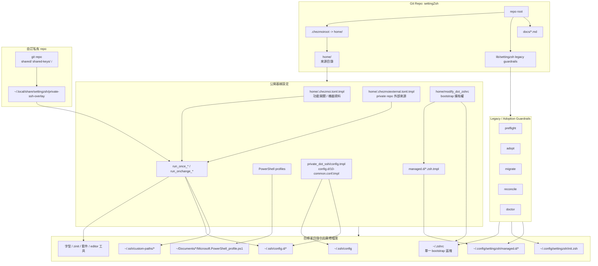
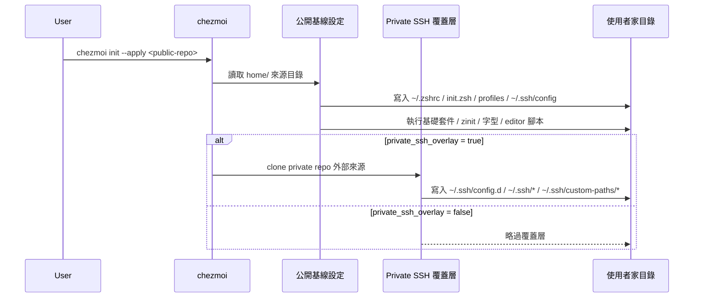
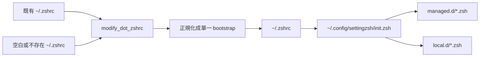

# settingZsh 架構圖

這份文件只做一件事：用圖把目前 `settingZsh` 的控制面、資料流與責任邊界畫清楚。

若你要看詳細文字說明，請回到 [architecture.md](./architecture.md)。
若你不熟圖裡的英文術語，先看 [terminology.md](./terminology.md)。

## 總覽

## 新機器首次安裝流程

## `.zshrc` 擁有權模型

## 邊界規則

- `public baseline` 是唯一主入口，負責非機密的公開基線設定。
- `custom private repo` 只負責 `~/.ssh/**`，不接管 `~/.ssh/config` 主檔。
- `legacy CLI` 只處理 adoption / migrate / reconcile，不再是新安裝主流程。
- `~/.zshrc` 只允許一個 `settingZsh bootstrap` 區塊；真正 shell 內容在 `init.zsh` 與 `managed.d/`。
